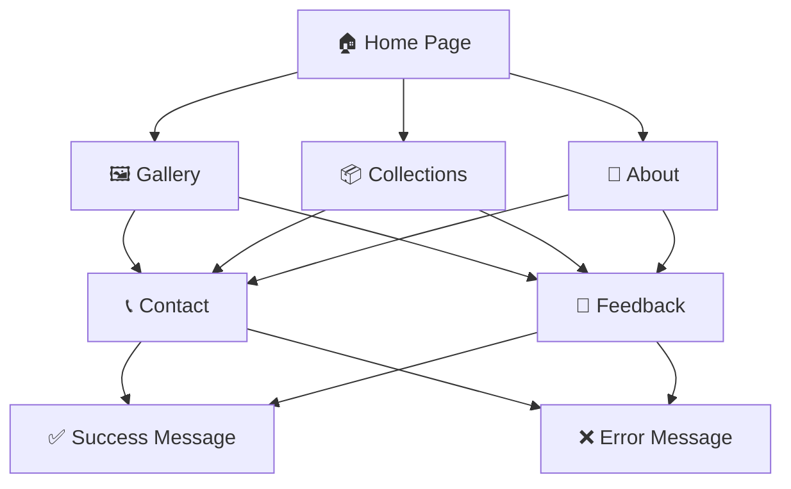

# Pascal Imitation Jewelry - Project Documentation

## ✨ Elegant Web Application for Jewelry Showcase ✨

**Project Duration:** 📅 August 25, 2025 - September 24, 2025

---

## 🎯 Project Overview

Pascal Imitation Jewelry is a **comprehensive web application** designed to showcase and manage imitation jewelry collections. It provides users with an **elegant platform** to explore different categories of jewelry, view gallery items, and communicate with the business through contact and feedback features.

---

## ⭐ Key Features

### 👥 User Features

| Feature | Description | Icon |
|---------|-------------|------|
| **🔐 User Registration & Login** | Secure access to personalized features | 📱 |
| **👤 Profile Management** | Update profile details and reset passwords | ⚙️ |
| **💎 Jewelry Collections** | Explore categorized jewelry items | 📦 |
| **🖼️ Gallery Page** | Organized display of jewelry items | 🎨 |
| **ℹ️ About Page** | Learn about Pascal Imitation Jewelry | 📖 |
| **📞 Contact Page** | Reach out for inquiries or support | ✉️ |
| **💬 Feedback Page** | Provide suggestions and reviews | 📝 |

### 💎 Jewelry Categories

| Category | Icon | Description |
|----------|------|-------------|
| **Bangles** | 💍 | Beautiful wrist accessories |
| **Watches** | ⌚ | Elegant timepieces |
| **Rings** | 💎 | Stunning finger jewelry |
| **Necklaces** | 📿 | Graceful neck pieces |
| **Cufflinks** | 👔 | Sophisticated shirt accessories |

---

## 🛠️ Technology Stack

### 🎨 Frontend Development

### ⚙️ Backend Architecture
- **Current**: Static with client-side scripting
- **Future Ready**: Designed for backend integration
- **Scalable**: Modular architecture for expansion

---

## 🔄 User Flow

---

## 🚀 Installation & Setup

### 📋 Prerequisites

| Requirement | Status | Recommended |
|-------------|---------|-------------|
| **🌐 Web Browser** | ✅ Required | Chrome, Edge, Firefox |
| **💻 Code Editor** | ✅ Optional | VS Code, Sublime Text |
| **🖥️ Local Server** | ⚠️ Optional | XAMPP, WAMP |

### ⚡ Quick Start Guide

| Step | Action | Icon |
|------|--------|------|
| **1** | Clone or download the project repository | 📥 |
| **2** | Extract files and open folder in code editor | 📂 |
| **3** | Open `index.html` in web browser | 🌐 |
| **4** | *(Optional)* Run on local server | 🖥️ |

---

## 🎯 Project Objectives

  

    
🎨

    <h3>User-Centric Design</h3>
    
Intuitive and visually appealing interface

  

  
  

    
📊

    <h3>Collection Management</h3>
    
Organized product categorization

  

  
  

    
💬

    <h3>Effective Communication</h3>
    
Integrated feedback and contact options

  

  
  

    
📱

    <h3>Responsive Experience</h3>
    
Compatibility across all devices

  

---

## 📱 Application Screens

### Main Navigation Screens

  
🔐 Login

  
🏠 Home

  
📖 About

  
🖼️ Gallery

  
📦 Collections

  
💬 Feedback

  
📞 Contact

### Collection Sub-screens

  
💍 Bangles

  
⌚ Watches

  
💎 Rings

  
📿 Necklaces

  
👔 Cufflinks

---

## 🏁 Conclusion

### 🎉 Successfully Delivered!

**Pascal Imitation Jewelry** delivers a **responsive, user-friendly solution** for showcasing imitation jewelry collections online. The platform enables customers to explore products, connect with the business, and share feedback seamlessly.

---

### 🚀 Future Ready Architecture

Built with **scalability in mind**, the project accommodates future enhancements such as:

- **🗃️ Database Integration**
- **👨‍💼 Admin Panel Development**
- **🛒 E-commerce Features**
- **📱 Mobile App Extension**

---

  📱 Responsive Design
  ⚡ Modern Technology
  📈 Scalable Architecture
  👍 User Friendly

---

